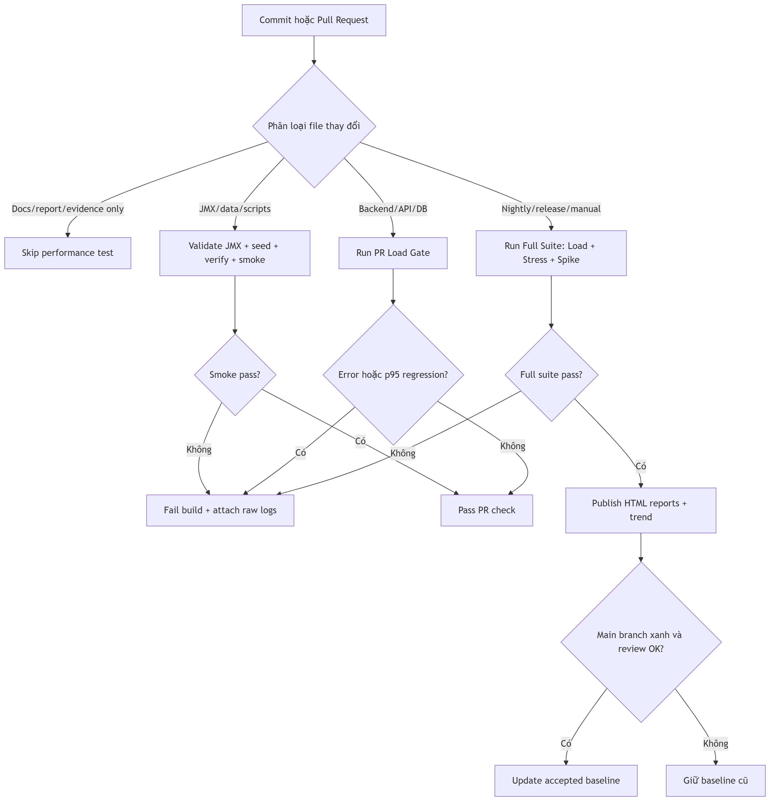

# Main Report HW05 - Performance Testing

**Student ID:** 23127522  
**SUT:** EShop backend, Node/Express + SQLite  
**Base URL:** `http://localhost:3000`  
**Tools:** Apache JMeter 5.6.3, JMeter Plugins Ultimate Thread Group, Task Manager/Resource Monitor, AI assistant  
**Main run date:** 2026-08-18  

## 1. Summary

This assignment performs performance testing for the EShop backend with JMeter using three main scenarios: Load, Stress, and Spike. All three scenarios use the same end-to-end workflow, called Flow A: the user logs in, reads the profile, browses categories/products, adds an item to the cart, applies a coupon, checks out, and views the order list.

Key results:

| Scenario | Main raw `.jtl` | HTML report | Raw rows | Max active threads | Total P95 | Total P99 | Throughput |
|---|---|---|---:|---:|---:|---:|---:|
| Load | `reports/results/23127522_Load_20260817.jtl` | `reports/load` | 5,000 | 81 | 19 ms | 30 ms | 33.17 req/s |
| Stress | `reports/results/23127522_Stress_20260818.jtl` | `reports/stress` | 147,593 | 500 | 1,635 ms | 5,163.87 ms | 290.01 req/s |
| Spike | `reports/results/23127522_Spike_20260818.jtl` | `reports/spike` | 32,850 | 300 | 448 ms | 794 ms | 157.21 req/s |

The Load test is a clean baseline with 0 errors. The Stress test shows a clear latency increase when the load reaches 500 active threads, but it does not show mass child HTTP failures. The Spike test is valid after reseeding the data; the earlier Spike run is excluded from the final conclusion because it contained many `401/403` errors caused by dirty data/login state.

## 2. Environment, Data, And Workflow

### 2.1 Runtime Environment

| Component | Value |
|---|---|
| Hostname | `LAPTOP-N9D07817` |
| CPU | Intel(R) Core(TM) Ultra 7 155H |
| Logical cores | 22 |
| RAM | 15.71 GB |
| OS | Microsoft Windows 11 Home Single Language |
| Backend process | `node.exe` |
| JMeter process | `java.exe` |

The backend uses SQLite, and the data can change after each restart/test run. Therefore, before each official run, I execute:

```bat
node scripts\seed-data.js
node scripts\verify-seed.js
```

Measurement limitation: JMeter and the backend run on the same machine, so the results represent the local hardware threshold of this machine, not production capacity.

### 2.2 Flow A

| Step | Request | Endpoint group | Note |
|---:|---|---|---|
| 1 | `POST /api/login` | Auth-heavy | Gets the JWT token for later requests. |
| 2 | `GET /api/users/me` | Auth-heavy | Verifies that the token is valid. |
| 3 | `GET /api/categories` | Read-heavy | Reads product categories. |
| 4 | `GET /api/products/:id` | Read-heavy | Reads product detail using data from CSV. |
| 5 | `POST /api/cart` | Transactional | Adds a product to the cart. |
| 6 | `GET /api/cart` | Transactional | Checks cart state. |
| 7 | `POST /api/apply-coupon` | Transactional | Applies a fixed coupon. |
| 8 | `POST /api/checkout` | Transactional | Creates an order. |
| 9 | `GET /api/orders/my-orders` | Transactional | Reads the user's order list. |

The requests are placed inside a Transaction Controller to measure the end-to-end time of the entire flow. The login request uses a JSON Extractor to store the token in `${authToken}`. Authenticated requests then use an HTTP Header Manager:

```text
Authorization: Bearer ${authToken}
```

### 2.3 Data-Driven Testing

| File | Role |
|---|---|
| `data/users.csv` | 500 main users for Load/Stress/Spike. |
| `data/products.csv` | Product IDs, categories, and prices for data-driven product/cart/checkout requests. |
| `data/coupons.csv` | Fixed coupons, avoiding the percent-coupon bug that miscalculates `final_amount`. |
| `data/users_lockout.csv` | Separate users for lockout testing, so the 500 main users are not polluted. |

Data-driven testing means the test plan does not hard-code a single user/product. JMeter reads each CSV row, maps values into variables, and uses those variables in requests. This allows each virtual user to follow the same business flow with different data.

## 3. How To Run And Read JMeter Output

### 3.1 General Preparation

Start the backend in a separate terminal:

```bat
cd /d "<project-root>\eshop-sut\backend"
node server.js
```

In the test terminal:

```bat
cd /d "<project-root>"
node scripts\seed-data.js
node scripts\verify-seed.js
```

When running JMeter in non-GUI mode, remove the old `.jtl` file and the old report directory first. Otherwise, JMeter may report that the file/folder already exists or append to an old result, which would corrupt the numbers.

### 3.2 Main Output Meaning

| Output | Meaning |
|---|---|
| `.jtl` | Raw log for each sample. This is the primary source for checking pass/fail, response code, failing label, and active threads. |
| `statistics.json` | Aggregated file generated by the HTML dashboard, used for avg, median, p90, p95, p99, and throughput. |
| `index.html` | Visual dashboard generated by JMeter from `.jtl`; used for presentation and graph review. |
| Console `summary +` | Statistics for the latest interval. |
| Console `summary =` | Cumulative statistics, but it should not be used alone if the `.jtl` file contains data. |

Common fields in `.jtl`:

| Field | Meaning |
|---|---|
| `timeStamp` | Time when the sample was recorded, in epoch milliseconds. |
| `elapsed` | Total sample processing time in ms. |
| `label` | Sampler or transaction name, for example `01 POST login` or `Flow A - Login Browse Cart Checkout`. |
| `responseCode` | HTTP status code. If it is blank on a transaction parent, it is not a real HTTP response. |
| `responseMessage` | Message associated with the response code. |
| `success` | `true`/`false` based on assertions and sampler status. |
| `failureMessage` | Failure reason, if any. |
| `bytes` | Number of bytes received. |
| `sentBytes` | Number of bytes sent. |
| `grpThreads` | Active threads in the Thread Group at sample time. |
| `allThreads` | Total active threads at sample time. |
| `Latency` | Time until the first byte is received, in ms. |
| `Connect` | Connection setup time, in ms. |

Metrics in `statistics.json`/HTML report:

| Metric | Meaning |
|---|---|
| `Samples` | Number of samples counted in the dashboard. It may differ from `.jtl` row count if transaction parents or filters are involved. |
| `Error %` | Percentage of failed samples. The raw `.jtl` must be checked to know whether failures are child HTTP failures or transaction parent artifacts. |
| `Average` | Mean response time. It is sensitive to outliers. |
| `Median` | P50, meaning 50% of requests are faster than this value. |
| `90% Line`/`P90` | 90% of requests are faster than this value. |
| `95% Line`/`P95` | 95% of requests are faster than this value; this is the main metric for detecting regression. |
| `99% Line`/`P99` | 99% of requests are faster than this value; used for tail latency. |
| `Throughput` | Number of requests per second handled during the run. |
| `Received KB/sec` | Data receive rate from the server. |
| `Sent KB/sec` | Data send rate to the server. |

## 4. Sequential Review Of The Three Test Plans

### 4.1 Load Test

**Goal:** measure a stable baseline when 500 virtual users run Flow A once with a moderate ramp-up. This scenario shows how fast/slow the system is under normal expected load before increasing pressure.

**Files and report:**

| Component | Value |
|---|---|
| Test plan | `test-plans/23127522_Load_20260817.jmx` |
| Listener/report view | Aggregate Report |
| Raw result | `reports/results/23127522_Load_20260817.jtl` |
| HTML report | `reports/load/index.html` |
| Screenshot | `reports/evidence/23127522_Load_20260817.png` |

**How to run:**

```bat
cd /d "<project-root>"

if not exist reports\results mkdir reports\results
rmdir /s /q reports\load
del /q reports\results\23127522_Load_20260817.jtl

jmeter -n ^
  -t test-plans\23127522_Load_20260817.jmx ^
  -l reports\results\23127522_Load_20260817.jtl ^
  -e -o reports\load ^
  -Jsummariser.name=summary ^
  -Jsummariser.interval=10 ^
  -Jsummariser.out=true ^
  -Jsummariser.log=true
```

**Configuration explanation:**

| Parameter | Value | Meaning |
|---|---:|---|
| Number of Threads | 500 | Total virtual users created during the run. |
| Ramp-up period | 120s | JMeter does not start all 500 users immediately; it spreads them over 120 seconds. |
| Loop Count | 1 | Each user runs Flow A once. |
| Think time | Per plan | Simulates user thinking time between actions. |
| Aggregate Report | 1 listener | Used to review avg, median, percentiles, and throughput per sampler. |

**Result:**

| Metric | Value |
|---|---:|
| Raw rows | 5,000 |
| Pass | 5,000 |
| Fail | 0 |
| Max active threads observed in `.jtl` | 81 |
| Total samples in `statistics.json` | 4,500 |
| Error % | 0.0000% |
| Avg | 8.16 ms |
| Median | 6 ms |
| P90 | 15 ms |
| P95 | 19 ms |
| P99 | 30 ms |
| Throughput | 33.17 req/s |

**Analysis:** The Load test is clean because all 5,000 raw rows passed. P95 of 19 ms and P99 of 30 ms show a very low baseline. Max active threads reached only 81 even though the plan configured 500 users because each user completed the flow quickly and ramp-up lasted 120 seconds. Therefore, this Load test measures 500 total users, not 500 concurrent users at every moment.

### 4.2 Stress Test

**Goal:** increase the load in steps to observe how latency, throughput, and errors change as active threads approach 500. A Stress test does not only ask whether the system passes; it asks where the system starts to degrade.

**Files and report:**

| Component | Value |
|---|---|
| Test plan | `test-plans/23127522_Stress_20260818.jmx` |
| Listener/report view | Summary Report |
| Raw result | `reports/results/23127522_Stress_20260818.jtl` |
| HTML report | `reports/stress/index.html` |
| Screenshot | `reports/evidence/23127522_Stress_20260818.png` |

**How to run:**

```bat
cd /d "<project-root>"

if not exist reports\results mkdir reports\results
rmdir /s /q reports\stress
del /q reports\results\23127522_Stress_20260818.jtl

jmeter -n ^
  -t test-plans\23127522_Stress_20260818.jmx ^
  -l reports\results\23127522_Stress_20260818.jtl ^
  -e -o reports\stress ^
  -Jsummariser.name=summary ^
  -Jsummariser.interval=10 ^
  -Jsummariser.out=true ^
  -Jsummariser.log=true
```

**Ultimate Thread Group configuration explanation:**

| Step | Added threads | Initial delay | Startup | Hold | Shutdown | Meaning |
|---:|---:|---:|---:|---:|---:|---|
| 1 | 100 | 0s | 30s | 420s | 10s | Creates a 100-user baseline. |
| 2 | 100 | 90s | 30s | 330s | 10s | Increases to about 200 users. |
| 3 | 100 | 180s | 30s | 240s | 10s | Increases to about 300 users. |
| 4 | 100 | 270s | 30s | 150s | 10s | Increases to about 400 users. |
| 5 | 100 | 360s | 30s | 60s | 10s | Increases to about 500 users. |

Parameter meaning:

| Parameter | Meaning |
|---|---|
| `threads` | Number of virtual users for that step. |
| `initial_delay` | How long to wait from test start before this step starts. |
| `startup_time` | Ramp-up time for that step. |
| `hold_load_for` | How long to hold the load after the step finishes ramping up. |
| `shutdown_time` | How long to ramp down users from that step. |

**Overall result:**

| Metric | Value |
|---|---:|
| Raw rows | 147,593 |
| Pass | 147,550 |
| Fail | 43 |
| Max active threads | 500 |
| Duration | 459.36s |
| Total samples in `statistics.json` | 133,090 |
| Error % | 0.0323% |
| Avg | 444.95 ms |
| Median | 907 ms |
| P90 | 1,420 ms |
| P95 | 1,635 ms |
| P99 | 5,163.87 ms |
| Throughput | 290.01 req/s |

**Slowest endpoints by P95:**

| Sampler | Samples | Errors | Avg | P95 | P99 |
|---|---:|---:|---:|---:|---:|
| Flow A parent | 15,003 | 43 | 3,868.12 ms | 8,370.80 ms | 8,763.96 ms |
| `07 POST apply coupon` | 14,637 | 0 | 757.44 ms | 1,662 ms | 1,857 ms |
| `01 POST login` | 14,960 | 0 | 488.15 ms | 1,194 ms | 1,375 ms |
| `08 POST checkout` | 14,578 | 0 | 450.00 ms | 1,010 ms | 1,144.21 ms |
| `09 GET my orders` | 14,522 | 0 | 446.36 ms | 1,010 ms | 1,146.77 ms |

**Slice by active threads:**

| Active threads | Samples | Avg | P95 | P99 | Approx. throughput |
|---|---:|---:|---:|---:|---:|
| 1-100 | 12,942 | 39 ms | 75 ms | 573 ms | 28.20 req/s |
| 101-200 | 25,337 | 112.16 ms | 288 ms | 401 ms | 69.04 req/s |
| 201-300 | 30,448 | 303.21 ms | 606 ms | 824 ms | 110.81 req/s |
| 301-400 | 32,353 | 538.04 ms | 1,008 ms | 1,219 ms | 176.16 req/s |
| 401-500 | 31,510 | 853.89 ms | 1,526 ms | 1,763 ms | 347.60 req/s |

**Analysis:** The Stress test achieved the goal of reaching 500 active threads. As load increased, latency increased clearly: child HTTP P95 rose from about 606 ms in the 201-300 bucket to 1,526 ms in the 401-500 bucket. The most notable endpoint is `07 POST apply coupon`, with P95 of 1,662 ms. The 43 errors are not backend HTTP failures; all of them are on the transaction parent `Flow A - Login Browse Cart Checkout`, with blank response code and `Response was null`, while child HTTP requests contain 147,550 `200` rows.

### 4.3 Spike Test

**Goal:** check how the system reacts when load increases suddenly. Unlike Stress, Spike does not increase load through long gradual steps; it creates a fast jump from a 20 VU baseline to 300 VU.

**Files and report:**

| Component | Value |
|---|---|
| Test plan | `test-plans/23127522_Spike_20260818.jmx` |
| Listener/report view | View Results Tree |
| Main raw result | `reports/results/23127522_Spike_20260818.jtl` |
| Main HTML report | `reports/spike/index.html` |
| Screenshot | `reports/evidence/23127522_Spike_20260818.png` |

**How to run:**

```bat
cd /d "<project-root>"

if not exist reports\results mkdir reports\results
rmdir /s /q reports\spike
del /q reports\results\23127522_Spike_20260818.jtl

jmeter -n ^
  -t test-plans\23127522_Spike_20260818.jmx ^
  -l reports\results\23127522_Spike_20260818.jtl ^
  -e -o reports\spike ^
  -Jsummariser.name=summary ^
  -Jsummariser.interval=10 ^
  -Jsummariser.out=true ^
  -Jsummariser.log=true
```

In this report, I use the valid rerun at `reports/results/23127522_Spike_20260818.jtl` and `reports/spike`, because the earlier Spike run had data/login issues.

**Ultimate Thread Group configuration explanation:**

| Phase | Threads | Initial delay | Startup | Hold | Shutdown | Meaning |
|---|---:|---:|---:|---:|---:|---|
| Baseline | 20 | 0s | 10s | 170s | 10s | Keeps low background load to show stable behavior before the spike. |
| Spike | 280 | 60s | 5s | 30s | 5s | Quickly adds 280 users, reaching a peak of 300 users. |

**Valid rerun result:**

| Metric | Value |
|---|---:|
| Raw rows | 32,850 |
| Pass | 32,809 |
| Fail | 41 |
| Max active threads | 300 |
| Duration | 189.38s |
| Total samples in `statistics.json` | 29,689 |
| Error % | 0.1381% |
| Avg | 105.90 ms |
| Median | 47 ms |
| P90 | 288 ms |
| P95 | 448 ms |
| P99 | 794 ms |
| Throughput | 157.21 req/s |

**Excluded invalid Spike run:**

| File | Rows | `200` | `401` | `403` | Blank | Failed |
|---|---:|---:|---:|---:|---:|---:|
| Earlier invalid Spike run | 41,238 | 12,371 | 8,444 | 20,385 | 38 | 28,867 |

**Analysis:** Spike has P95 of 448 ms and P99 of 794 ms, much better than Stress because the duration is shorter and the peak load is lower than Stress. The earlier failed run is not used for performance conclusions because mass `401/403` errors reflect dirty data/login state. After reseeding and verifying data, the child HTTP requests of the Spike run return `200`; the remaining 41 failures are blank transaction parent records and must be reviewed in `.jtl` instead of being treated as backend failures.

## 5. Monitoring And Evidence

During test execution, I monitor:

| Process | Meaning |
|---|---|
| `node.exe` | EShop backend, the SUT whose CPU/RAM should be observed. |
| `java.exe` | JMeter load generator, which must be separated from backend resource usage. |

Evidence:

| Scenario | Screenshot | Raw result | Report |
|---|---|---|---|
| Load | `reports/evidence/23127522_Load_20260817.png` | `reports/results/23127522_Load_20260817.jtl` | `reports/load/index.html` |
| Stress | `reports/evidence/23127522_Stress_20260818.png` | `reports/results/23127522_Stress_20260818.jtl` | `reports/stress/index.html` |
| Spike | `reports/evidence/23127522_Spike_20260818.png` | `reports/results/23127522_Spike_20260818.jtl` | `reports/spike/index.html` |

Demo video: https://youtu.be/GPZ94lcdWDI?si=GJrB3ISKFlGie_b2

## 6. AI Preview And Human Review

This section summarizes how I used AI for previews/recommendations, then verified the conclusions against raw `.jtl` and `statistics.json`. I do not use AI output as the final conclusion unless it has been checked against real measurements.

### 6.1 AI Preview

AI helped propose:

| AI-supported item | Human review |
|---|---|
| End-to-end Flow A design. | Kept because it covers auth-heavy, read-heavy, and transactional endpoints. |
| CSV-based data-driven testing. | Kept, with lockout users separated to avoid locking the main users. |
| Load/Stress/Spike with different load levels. | Adjusted Stress/Spike to Ultimate Thread Group to model continuous load more correctly. |
| P95 thresholds and optimization ideas. | Accepted only after checking raw `.jtl`, `statistics.json`, and code behavior. |

### 6.2 Misinterpretations Corrected

| Risky interpretation | Wrong conclusion | Correct value from raw log | Correction |
|---|---|---|---|
| Console shows `summary = 0` | The test did not run. | Load `.jtl` has 5,000 rows, 5,000 pass, 0 fail. | Do not conclude from one console line; check `.jtl` and report. |
| Stress has 43 failed samples | Backend returned HTTP errors. | All 43 failures are transaction parent `Response was null`; child HTTP has 147,550 `200` rows. | This is a transaction parent/shutdown artifact, not an HTTP backend failure. |
| Stress has 147,593 rows | There were 147,593 users. | Max active threads is 500. | `.jtl` rows are sample records; each user can generate many requests and multiple loops. |
| Load only shows max active threads 81 | Only 81 users ran. | `.jmx` has 500 threads, ramp-up 120s, loop 1; raw `.jtl` has 500 Flow A parent samples. | 500 is total virtual users, not concurrent users at every moment. |
| Earlier Spike run has high error rate | Backend fails under spike. | Invalid run has 8,444 `401`, 20,385 `403`, failed 28,867/41,238 rows. | This run is invalid due to dirty data/login state; use the valid rerun for analysis. |

### 6.3 Optimization Recommendation Review

| Recommendation | Classification | Reason |
|---|---|---|
| Add index `orders(user_id)` | Feasible | `GET /api/orders/my-orders` filters by user, so an index reduces scans as orders grow. |
| Add pagination for `my-orders` | Feasible | Prevents the response from growing indefinitely when a user has many orders. |
| Clear `userCarts` after checkout | Feasible | Reduces memory state and prevents old carts from affecting later loops. |
| Enable SQLite WAL | Feasible/needs benchmark | May improve read/write concurrency with SQLite. |
| Reduce logging in hot paths | Needs consideration | Useful if log I/O is heavy, but should not remove debug capability. |
| Separate the load generator from the SUT | Needs consideration | Improves measurement cleanliness, but it is not a backend optimization by itself. |
| Generic connection pool for embedded SQLite | Hallucinated/not suitable | Embedded SQLite is not a client-server DB; a generic pool does not automatically solve write bottlenecks. |

## 7. Task 3 - Continuous Performance Testing Model

### 7.1 Definition

Continuous Performance Testing is a model that brings performance testing into the continuous development lifecycle. Each commit or pull request is classified by risk, then mapped to the appropriate performance checks. The goal is to detect p95/p99 regression, increased error rate, or reduced throughput before a change is merged.

In this assignment, CPT does not mean running the full Stress/Spike suite on every commit. A tiered strategy is more suitable because it balances reliability and cost.

### 7.2 Tiered Test Model

| Change type | Test to run | Reason |
|---|---|---|
| Docs/report/evidence only | Skip performance test | Does not affect SUT runtime. |
| JMX/data/scripts | Validate JMX + seed + verify + smoke | These changes can easily break data, token handling, or the test plan. |
| Backend/API/DB | PR Load Gate | Detects early regression in Flow A. |
| Nightly/release/manual | Full suite: Load + Stress + Spike | Provides trend coverage for baseline, degradation, and spike behavior. |
| Weekly/manual soak | Endurance 10-15 minutes | Checks memory growth and p95 drift over time. |

### 7.3 Alert Rules

| Rule | Result |
|---|---|
| p95 increases by > 20% compared with baseline and absolute increase is > 100 ms | Flag p95 regression. |
| Child HTTP error rate > 0.5% in Load/PR gate | Fail build. |
| Many `5xx`, timeout, or connection refused errors | Fail build. |
| Mass `401/403` errors | Mark invalid, reseed, and rerun. |
| Stress/Spike has parent `Response was null` but child HTTP `200` | Warning, requires human `.jtl` review. |
| Throughput decreases by > 15% while active threads are comparable | Flag throughput regression. |

Proposed hard thresholds:

| Scenario | Proposed threshold |
|---|---|
| Load | Total P95 <= 500 ms, child HTTP error = 0%. |
| Stress | Total P95 <= 3,000 ms, child HTTP error < 1%, backend must not crash. |
| Spike | Total P95 <= 1,500 ms, child HTTP error < 1%, throughput should recover after the spike. |
| Proposed Endurance | 250-300 active threads for 10-15 minutes; requires a separate soak run for official confirmation. |

### 7.4 Flowchart



### 7.5 Trade-Offs

| Trade-off | Benefit | Risk/handling |
|---|---|---|
| Do not run the full suite on every PR | Saves time | May miss issues that only appear under Stress/Spike; compensate with nightly runs. |
| Relative p95 threshold of 20% | Detects regression against the local baseline | Can create false alarms when baseline is very small; add absolute increase > 100 ms. |
| JMeter and backend on the same machine | Easy local setup | Resource usage is mixed; clearly state that this is a local threshold. |
| Reseed data every run | Avoids fake `401/403` errors | Takes extra time but is necessary. |
| Manual baseline update | Avoids normalizing regressions | Requires human review before accepting a new baseline. |

## 8. Bugs And Performance Issues

| Issue | Type | Impact | GitHub |
|---|---|---|---|
| Lockout actually happens after 2 wrong attempts instead of the expected 3 | Functional/security | Medium | [#3](https://github.com/venncoder08/HW05_Performance_Testing/issues/3) |
| Percent coupon calculates `final_amount` incorrectly | Functional | High if percent coupons are used | [#5](https://github.com/venncoder08/HW05_Performance_Testing/issues/5) |
| `apply-coupon` does not require authentication | Security/logic | Medium | [#2](https://github.com/venncoder08/HW05_Performance_Testing/issues/2) |
| `price` sometimes returns as string and sometimes as number | API consistency | Low-Medium | [#4](https://github.com/venncoder08/HW05_Performance_Testing/issues/4) |
| `my-orders` lacks pagination/index | Performance risk | Medium-High | [#6](https://github.com/venncoder08/HW05_Performance_Testing/issues/6) |

## 9. Conclusion

The Load test provides a stable baseline: all 5,000 raw rows passed, with Total P95 of 19 ms and P99 of 30 ms. The Stress test reached 500 active threads and 290.01 req/s throughput; latency increased clearly with Total P95 of 1,635 ms and P99 of 5,163.87 ms, but the 43 recorded failures are transaction parent `Response was null` records, not child HTTP failures. The Spike test reached 300 active threads, with Total P95 of 448 ms and P99 of 794 ms; the earlier Spike run is excluded because it had many `401/403` errors caused by dirty data/login state.

The optimizations to prioritize are adding an index on `orders(user_id)`, adding pagination for `my-orders`, clearing `userCarts` after checkout, and benchmarking SQLite WAL. The proposed CPT model helps detect p95 regression earlier in future commits, but it must always reseed clean data and check raw `.jtl` before drawing conclusions.
